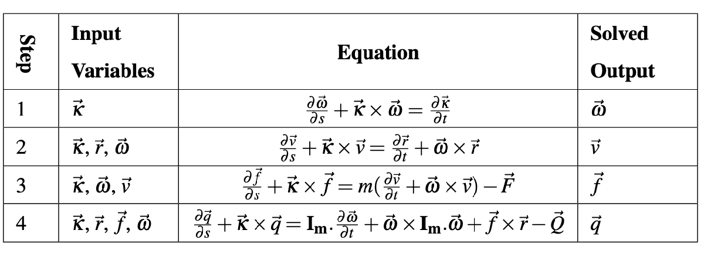
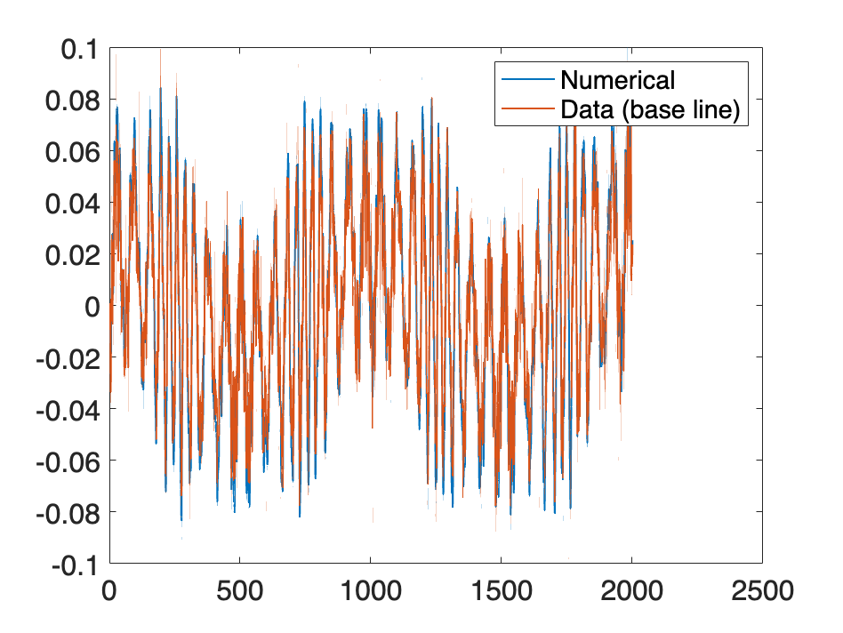

# Inverse Rod Model Code

**The rod model equations and an inverse method algorithm:**





 **To understand the inverse algorithm used, see** [**Discretization Scheme (Section 4.2):**](https://drive.google.com/file/d/17qbHc1oj8cz9fjsMbCqZxY9cbfCvOirG/view?usp=sharing)

1.  The temporal derivatives are approximated by second order central difference formula
2. The spatial derivatives for equations in Step 1 and 2 are discretized by backward difference formula (BC known at clamp end, $s=0$ )
3. The spatial derivatives for equations in Step 3 and 4 are discretized by forward difference formula (BC known at free end, $s=L$ )

 $$ \begin{array}{l} ({I_d }+\Delta s{\tilde{\kappa} }_{i,j} ){{\omega }}_{i,j} ={{\omega }}_{i,j-1} +\Delta s\left(\frac{\kappa_{i+1,j} -\kappa_{i-1,j} }{2\Delta t}\right)\newline ({I_d }+\Delta s{\tilde{\kappa} }_{i,j} )v_{i,j} =v_{i,j-1} +\Delta s\left({{\omega }}_{i,j} \times r_{i,j} \right)\newline ({I_d }-\Delta s{\tilde{\kappa} }_{i,j} )f_{i,j} =f_{i,j+1} -m\Delta s\left(\frac{v_{i+1,j} -v_{i-1,j} }{2\Delta t}+{{\omega }}_{i,j} \times v_{i,j} \right)\newline ({I_d }-\Delta s{\tilde{\kappa} }_{i,j} )q_{i,j} =q_{i,j+1} -\Delta s{I_m }\left(\frac{{{\omega }}_{i+1,j} -{{\omega }}_{i-1,j} }{2\Delta t}\right)-\Delta s\left({{\omega }}_{i,j} \times ({I_m }{{\omega }}_{i,j} )+f_{i,j} \times r_{i,j} \right) \end{array} $$ 

where the indices $i$ and $j$ are enumerating the time\-steps and space\-steps and ${I_d }$ is 3 by 3 identity matrix

```matlab
clc;

%% Parameters
dt = 0.001;      % Time step size
ds = 0.01;       % Step size for filament

nT = length(squeeze(Y_true(7:9,1,:))); % Number of time steps
nL = length(squeeze(Y_true(7:9,:,1))); % Number of sections

% Physical properties
m = 9.8;                 % Mass per unit length
radi = 0.0141 / 2;       % Radius
Ac = pi * radi^2;        % Cross-sectional area
ro = m / Ac;             % Density

I1 = (pi / 4) * (radi^4);
I2 = I1;
I_m = [ro * I1, 0, 0;
     0, ro * I2, 0;
     0, 0, ro * (I1 + I2)];  % Moment per unit arc length

%% Initialize Variables
f = zeros(3, nL, nT);
F = zeros(3, nL, nT);
q = zeros(3, nL, nT);
v = zeros(3, nL, nT);
w = zeros(3, nL, nT);
k = zeros(3, nL, nT);

%% Importing Curvature Matrix (name should be same as the imported data name)
% Define folder and load file
% folderName = fullfile(pwd, 'folder');
% file = dir(fullfile(folderName, 'file.mat'));
% load(fullfile(folderName, files(i).name));

%% Imported Data Name
Y_true = Y_time_march_bend;

k(:,:,:) = Y_true(7:9,:,:);

%% Initial and Boundary conditions should be same for the inverse code as
%% its in the forward code used to generate data

%% Initial Conditions
w(:,:,1) = zeros(3, nL, 1);
v(:,:,1) = zeros(3, nL, 1);
f(:,:,1) = zeros(3, nL, 1);
q(:,:,1) = zeros(3, nL, 1);

%% Boundary Conditions (Bending case)
v(:,1,2:end) = zeros(3, 1, nT-1);
w(:,1,2:end) = zeros(3, 1, nT-1);
f(:,nL,2:end) = zeros(3, 1, nT-1);
q(:,nL,2:end) = zeros(3, 1, nT-1);

for i = 2:nT
    t = dt * (i - 1);
    q(2, nL, i) = 30720 * (sin(2 * pi * t))^5 - 38400 * (sin(2 * pi * t))^3 + 40000 * sin(2 * pi * t);
end

% %% Boundary Conditions (Shear case)
% v(:,1,2:end) = zeros(3,1,nT-1);
% w(:,1,2:end) = zeros(3,1,nT-1);
% f(:,nL,2:end) = zeros(3,1,nT-1);
% f(1,nL,2:end) = 15000*ones(1,1,nT-1);    %(positive case, negative case would be -15000)
% q(:,nL,2:end) = zeros(3,1,nT-1);
```

```matlab
%% Integration of w and v
for i = 2:nT-1
    for j = 2:nL
        w(:,j,i) = (eye(3) + ds*skew_conv(k(:,j,i)))^(-1)*(w(:,j-1,i) + ds*((k(:,j,i+1)-k(:,j,i-1))/(2*dt)));
        v(:,j,i) = (eye(3) + ds*skew_conv(k(:,j,i)))^(-1)*(v(:,j-1,i) + ds*cross(w(:,j,i),[0;0;1]));
    end
end

for j = 2:nL
    w(:,j,nT) = (eye(3) + ds*skew_conv(k(:,j,nT)))^(-1)*(w(:,j-1,nT) + ds*((k(:,j,nT)-k(:,j,nT-1))/(dt)));
    v(:,j,nT) = (eye(3) + ds*skew_conv(k(:,j,nT)))^(-1)*(v(:,j-1,nT) + ds*cross(w(:,j,nT),[0;0;1]));
end

%% Integration of f and q
for i = 2:nT-1
    for j = nL-1:-1:1
        f(:,j,i) = ((eye(3) - ds*skew_conv(k(:,j,i)))^(-1))*(f(:,j+1,i) - m*ds*((v(:,j,i+1)-v(:,j,i-1))/(2*dt) + cross(w(:,j,i),v(:,j,i))));
        q(:,j,i) = ((eye(3) - ds*skew_conv(k(:,j,i))))^(-1)*(q(:,j+1,i) - ds*I_m*((w(:,j,i+1)-w(:,j,i-1))/(2*dt)) - ds*(cross(w(:,j,i),I_m*w(:,j,i)) + cross(f(:,j,i),[0;0;1]))); 
    end
end

for j = nL-1:-1:1
    f(:,j,nT) = ((eye(3) - ds*skew_conv(k(:,j,nT)))^(-1))*(f(:,j+1,nT) - m*ds*((v(:,j,nT)-v(:,j,nT-1))/(dt) + cross(w(:,j,nT),v(:,j,nT))));
    q(:,j,nT) = ((eye(3) - ds*skew_conv(k(:,j,nT))))^(-1)*(q(:,j+1,nT) - ds*I_m*((w(:,j,nT)-w(:,j,nT-1))/(dt)) - ds*(cross(w(:,j,nT),I_m*w(:,j,nT)) + cross(f(:,j,nT),[0;0;1]))); 
end
```

```matlab
%% Save Results
Y_num = zeros(15, nL, nT);
Y_num(1:3, :, :) = v;
Y_num(4:6, :, :) = w;
Y_num(7:9, :, :) = f;
Y_num(10:12, :, :) = q;
Y_num(13:15, :, :) = k;

% save('Y_num.csv', 'Y_num');
```

```matlab
%% Check if values from numerical match baseline values

set(0,'defaultTextInterpreter','latex')
plot(squeeze(Y_num(1, 5, :)),'LineWidth',1)
hold on
plot(squeeze(Y_true(1, 5, :)),'LineWidth',1)
legend('Numerical','Data (base line)')
hold off
set(gca,'FontSize',16);
```



```matlab

%% Compare true constitutive law with numerical values

%% Nonlinear
% k_true = squeeze(Y_true(8, :, :));
% q_true = 30.*k.^5 -600.*k.^3 + 10000.*k;
% x = squeeze(Y_num(14,:,:));
% y = squeeze(Y_num(11,:,:));
% plot(x(:),y(:),'g','Marker',"*","MarkerSize",6,"LineStyle","none")
% hold on
% plot(k_true(:),q_true(:),'r','Marker',".","MarkerSize",4,"LineStyle","none")
% hold off
% set(gca,'FontSize',16);
% xlabel(" !!!EQ_8!!! ")
% ylabel(" !!!EQ_9!!! ")
% h=legend('Numerical moment vs curvature','Exact constitutive law','fontsize',12);
% set(h,'Interpreter','latex','Location','northwest')

%% Nonlinear and Non-homogeneous
% len=0:ds:ds*(nL-1);
% x = squeeze(Y_num(14,:,:));
% y = squeeze(Y_num(11,:,:));
% z = repmat(len,[nT 1])';
% k_true = min(min(Y_time_march(8,:,:))):0.05:max(max(Y_time_march(8,:,:)));
% for i=1:length(len)
%     q_true(i,:)=(2*len(i)^3-4*len(i)^2+3*len(i)+1)*(600*k_true.^3+10000*k_true);
% end
% plot3(x(:),z(:),y(:),'g','Marker',"*","MarkerSize",6,"LineStyle","none")
% hold on
% surf(k_true,len',q_true,'FaceColor',[0 0 1],'FaceAlpha',1,'EdgeColor','none');
% hold off
% set(gca,'FontSize',16);
% xlabel(" !!!EQ_8!!! ")
% ylabel(" !!!EQ_11!!! ")
% zlabel(" !!!EQ_9!!! ")
% h=legend('Numerical moment vs curvature','Exact constitutive law','fontsize',12);
% set(h,'Interpreter','latex','Location','northwest')
```
# Convert vector into skew symmetry matrix
 $$ [{\textrm{a}}]_{\times } =\left\lbrack \begin{array}{ccc} 0 & -a_3  & a_2 \newline a_3  & 0 & -a_1 \newline -a_2  & a_1  & 0 \end{array}\right\rbrack $$ 
```matlab

function skew_mat = skew_conv(X)
    skew_mat=zeros(3,3);
    skew_mat(1,2)= -X(3,1);
    skew_mat(1,3)=  X(2,1);
    skew_mat(2,1)=  X(3,1);
    skew_mat(2,3)= -X(1,1);
    skew_mat(3,1)= -X(2,1);
    skew_mat(3,2)=  X(1,1);
end
```
